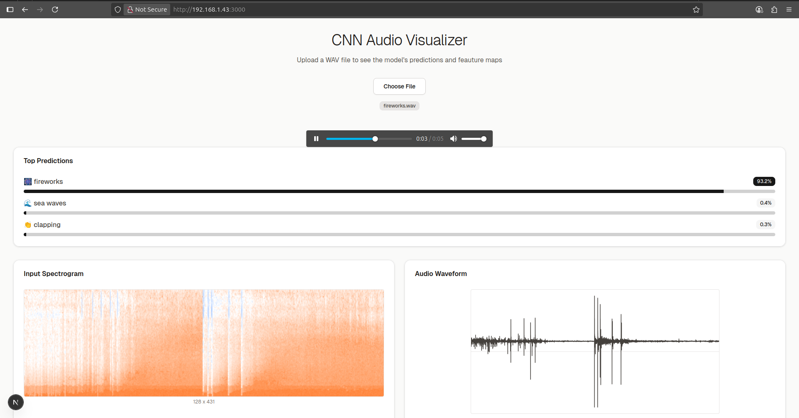
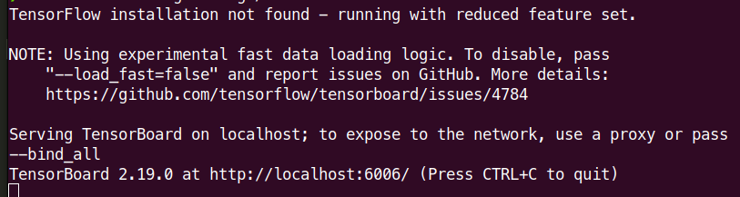
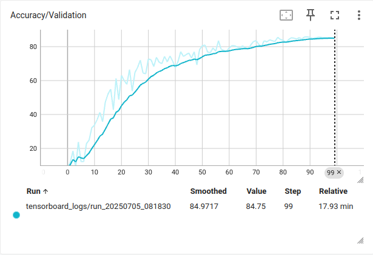
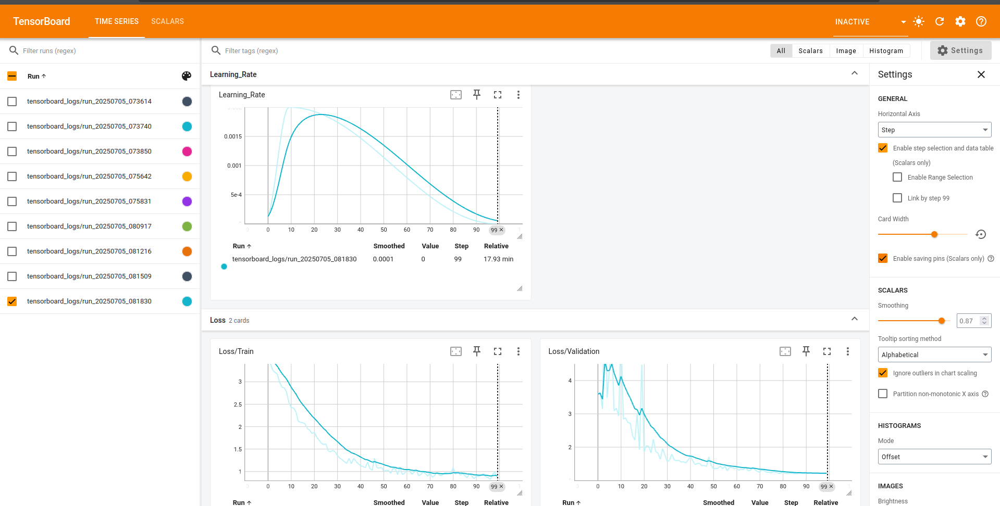

# Audio Classification with CNNs

A project for audio classification using Convolutional Neural Networks (CNNs), trained on the [ESC-50 dataset](https://github.com/karolpiczak/ESC-50). This project is designed to demonstrate the application of CNNs in audio processing tasks. It includes data preprocessing, model training, and evaluation steps.


## Project Overview

This project combines a Python-based backend with a FastAPI server and a Next.js frontend to provide an end-to-end solution for audio classification. Key features include:
- Audio-to-image conversion: Transforms audio into Mel-spectrograms for CNN input.
- Data augmentation: Uses Mixup, Time Masking, and Frequency Masking to enhance model robustness.
- ResNet-based CNN: Employs a CNN architecture with residual connections and Batch Normalization for stable and efficient training.
- Optimization: Utilizes the AdamW optimizer with a OneCycleLR scheduler for improved convergence.
- Monitoring: Utilizes TensorBoard for visualizing training metrics.
- Data validation: Uses Pydantic for robust data parsing and validation.
- Frontend: A Next.js application with Tailwind CSS for a seamless user interface to upload and classify audio files.
- API: A FastAPI server to serve the trained model for real-time predictions.
## 📁 Project Structure

```plain
audioCNN/
│
├── backend/ # Model training & API
│ ├── esc50-data/ # ESC-50 dataset (place here)
│ ├── model.py # CNN model (ResNet-style)
│ ├── train.py # Training script
│ ├── predict.py # Inference logic
│ ├── main.py # FastAPI application
│ ├── requirements.txt # Python dependencies
│
├── frontend/ # Web-based UI using T3 App (Next.js + TailwindCSS)
│ ├── pages/
│ ├── components/
│ ├── public/
│ ├── ...
│
└── README.md
```
## 📦 Requirements

Make sure Python ≥3.8 and Node.js are installed.

### Python (backend)

```bash
cd backend
pip install -r requirements.txt
```


To train the model, you will need to have the ESC-50 dataset downloaded and placed in the `backend/esc50-data/` directory, by using the following command:

```bash
mkdir -p /esc50-data
cp -r /tmp/ESC-50-master/* /data/esc50-data/
rm -rf esc50.zip ESC-50-master
rm -rf /tmp/ESC-50-master
```

## Train the Model
To train the CNN model, run the training script from the backend directory:
```bash
cd backend
python train.py
```
This script preprocesses the audio data, trains the model, and saves checkpoints to the `logs/` directory.
The training process includes:
- Audio preprocessing: Converts audio files to Mel-spectrograms.
- Data augmentation: Applies Mixup, Time Masking, and Frequency Masking to enhance the model's robustness.
- Model architecture: A CNN with ResNet-style blocks and Batch Normalization for stability and fast training.
- Optimization: Uses the AdamW optimizer with a OneCycleLR scheduler for improved convergence.  
- Validation: Measures data parsing and validation using Pydantic.

## Monitoring Training Progress
To visualize training progress (e.g., loss and accuracy metrics), use TensorBoard: 
```bash
tensorboard --logdir=logs/
```
Open your browser and navigate to http://localhost:6006 to view the training logs.






## Run the FastAPI Server
To serve the trained model for predictions, start the FastAPI server from the `backend` directory:
```bash
uvicorn main:app --reload --host 0.0.0.0 --port 8000
```

You can then send audio files to the API for classification using a POST request to `http://localhost:8000/predict`.
For a sample request, you can use the following `curl` command:

```bash
curl -X POST "http://localhost:8000/predict" -F "file=@path/to/your/audio/file.wav"
``` 

## Run the Frontend
The project also includes a simple HTML interface to upload audio files and get predictions. You can access it by navigating to `http://localhost:8000` in your web browser. This using T3 app with Next.js and Tailwind CSS for the frontend. You can run the frontend server using (you should run the backend server first):


```bash
cd frontend
npm install
npm run dev
```
Navigate to http://localhost:3000 in your browser to access the interface. Upload an audio file (WAV format) to receive classification results.


## Special Thanks
This project is inspired by the work of [Andreas Trolle](https://www.youtube.com/@andreastrolle) 
